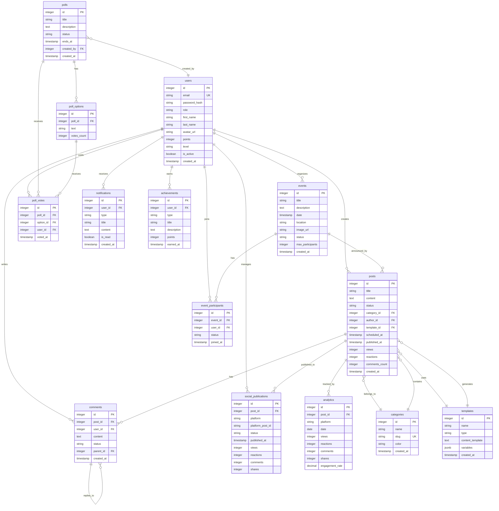
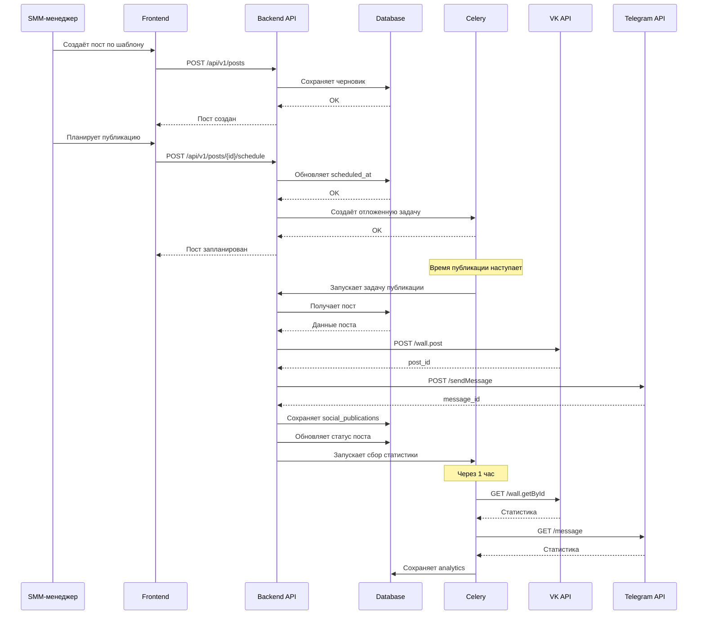
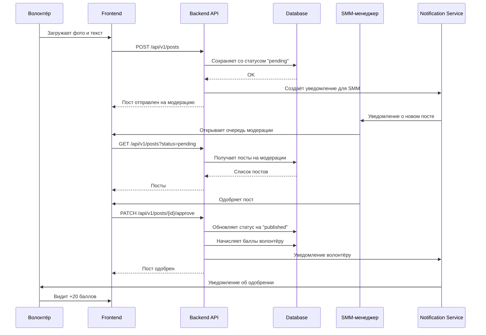
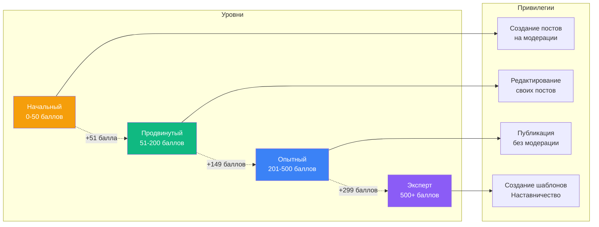
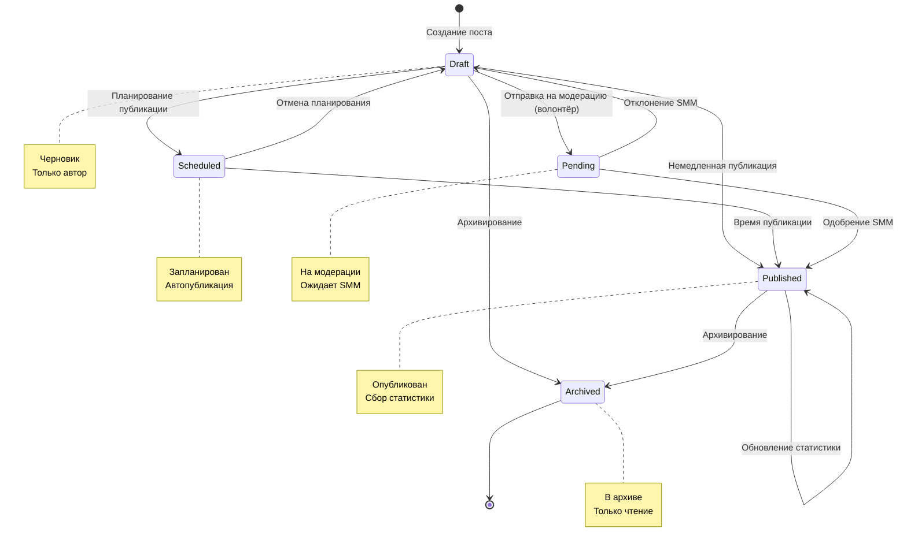
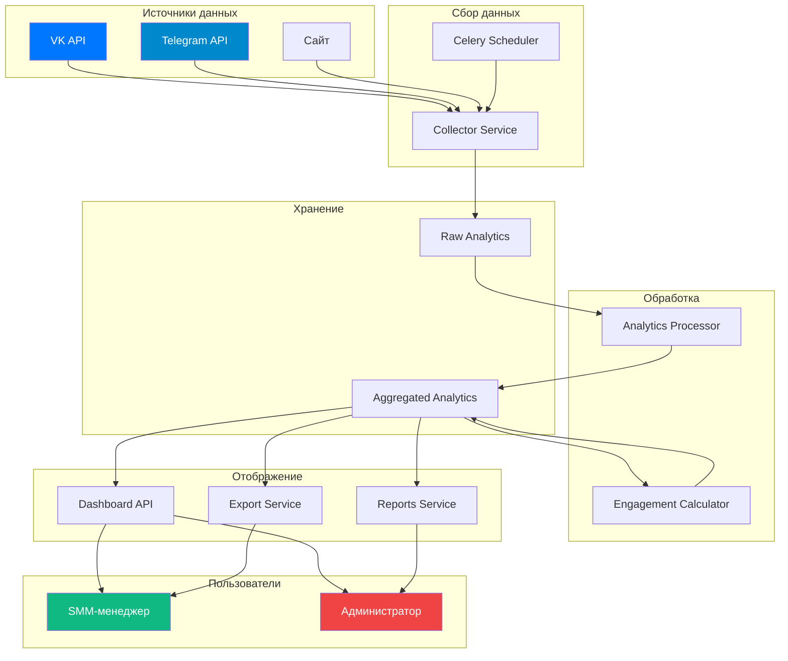
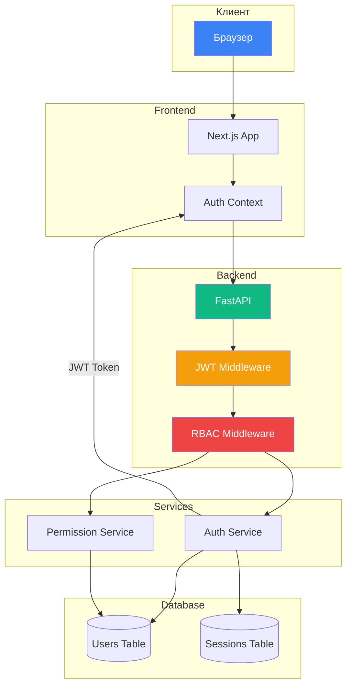

# Визуализация проекта «Медиахаб для молодёжного центра»

## 1. Карта сайта

```mermaid
graph TD
    Root[Медиахаб]
    
    Root --> Landing[Главная страница]
    Landing --> A1[Анонсы мероприятий]
    Landing --> A2[Лента новостей]
    Landing --> A3[Календарь событий]
    Landing --> A4[Регистрация волонтёра]
    
    Root --> Auth[/auth - Авторизация]
    Auth --> B1[Вход]
    Auth --> B2[Регистрация]
    Auth --> B3[Восстановление пароля]
    
    Root --> Dashboard[/dashboard - Панель управления]
    
    Dashboard --> SMM[/smm - SMM-менеджер]
    SMM --> C1[/calendar - Календарь контента]
    SMM --> C2[/posts - Управление постами]
    C2 --> C2a[Создание поста]
    C2 --> C2b[Редактирование]
    C2 --> C2c[Шаблоны]
    C2 --> C2d[Модерация]
    SMM --> C3[/events - График мероприятий]
    C3 --> C3a[Создание]
    C3 --> C3b[Редактирование]
    C3 --> C3c[Архив]
    SMM --> C4[/analytics - Аналитика]
    C4 --> C4a[Дашборд]
    C4 --> C4b[Статистика]
    C4 --> C4c[Отчёты]
    SMM --> C5[/comments - Модерация]
    SMM --> C6[/polls - Опросы]
    SMM --> C7[/seo - SEO]
    SMM --> C8[/settings - Настройки]
    
    Dashboard --> Admin[/admin - Администратор]
    Admin --> D1[/users - Пользователи]
    D1 --> D1a[Список]
    D1 --> D1b[Роли]
    D1 --> D1c[Блокировка]
    Admin --> D2[/events - Мероприятия]
    Admin --> D3[/categories - Категории]
    Admin --> D4[/analytics - Аналитика сайта]
    Admin --> D5[/access - Доступ]
    Admin --> D6[/settings - Настройки]
    
    Dashboard --> Volunteer[/volunteer - Волонтёр]
    Volunteer --> E1[/profile - Профиль]
    E1 --> E1a[Личные данные]
    E1 --> E1b[Активность]
    E1 --> E1c[Достижения]
    Volunteer --> E2[/events - Мероприятия]
    E2 --> E2a[Доступные]
    E2 --> E2b[Мои]
    E2 --> E2c[Присоединиться]
    Volunteer --> E3[/content - Контент]
    E3 --> E3a[Загрузка медиа]
    E3 --> E3b[Создать пост]
    E3 --> E3c[Черновики]
    Volunteer --> E4[/leaderboard - Лидерборд]
    Volunteer --> E5[/notifications - Уведомления]
    
    Root --> Events[/events - Публичные мероприятия]
    Events --> F1[Календарь]
    Events --> F2[Карта]
    Events --> F3[Детальная страница]
    Events --> F4[Архив]
    
    Root --> News[/news - Новости]
    News --> G1[Лента]
    News --> G2[Категории]
    News --> G3[Детальная]
    
    Root --> Volunteers[/volunteers - Волонтёрство]
    Volunteers --> H1[Стать волонтёром]
    Volunteers --> H2[О программе]
    Volunteers --> H3[Лидерборд]
    Volunteers --> H4[FAQ]
    
    Root --> About[/about - О нас]
    About --> I1[О центре]
    About --> I2[Команда]
    About --> I3[Контакты]
    About --> I4[Правила]
    
    style Root fill:#3B82F6,color:#fff
    style SMM fill:#10B981,color:#fff
    style Admin fill:#EF4444,color:#fff
    style Volunteer fill:#F59E0B,color:#fff
```

---

## 2. Матрица доступа по ролям

```mermaid
graph LR
    subgraph Функции
        F1[Просмотр контента]
        F2[Создание постов]
        F3[Редактирование постов]
        F4[Удаление постов]
        F5[Публикация постов]
        F6[Модерация контента]
        F7[Календарь мероприятий]
        F8[Присоединение к событиям]
        F9[Загрузка медиафайлов]
        F10[Аналитика просмотров]
        F11[Аналитика сайта]
        F12[Модерация комментариев]
        F13[Создание опросов]
        F14[Настройка SEO]
        F15[Управление пользователями]
        F16[Назначение ролей]
        F17[Управление категориями]
        F18[Лидерборд]
    end
    
    subgraph Волонтёр
        V1[✅]
        V2[✅ ограничено]
        V3[⚠️ с разрешения]
        V4[❌]
        V5[❌]
        V6[❌]
        V7[✅ просмотр]
        V8[✅]
        V9[✅]
        V10[❌]
        V11[❌]
        V12[❌]
        V13[❌]
        V14[❌]
        V15[❌]
        V16[❌]
        V17[❌]
        V18[✅ просмотр]
    end
    
    subgraph SMM_менеджер
        S1[✅]
        S2[✅]
        S3[✅]
        S4[✅ свои]
        S5[✅]
        S6[✅]
        S7[✅ редакция]
        S8[✅]
        S9[✅]
        S10[✅]
        S11[❌]
        S12[✅]
        S13[✅]
        S14[✅]
        S15[❌]
        S16[❌]
        S17[❌]
        S18[✅ просмотр]
    end
    
    subgraph Администратор
        A1[✅]
        A2[✅]
        A3[✅]
        A4[✅]
        A5[✅]
        A6[✅]
        A7[✅ редакция]
        A8[✅]
        A9[✅]
        A10[✅]
        A11[✅]
        A12[✅]
        A13[✅]
        A14[❌]
        A15[✅]
        A16[✅]
        A17[✅]
        A18[✅ просмотр+редакция]
    end
    
    F1 --> V1 & S1 & A1
    F2 --> V2 & S2 & A2
    F3 --> V3 & S3 & A3
    F4 --> V4 & S4 & A4
    F5 --> V5 & S5 & A5
    F6 --> V6 & S6 & A6
    F7 --> V7 & S7 & A7
    F8 --> V8 & S8 & A8
    F9 --> V9 & S9 & A9
    F10 --> V10 & S10 & A10
    F11 --> V11 & S11 & A11
    F12 --> V12 & S12 & A12
    F13 --> V13 & S13 & A13
    F14 --> V14 & S14 & A14
    F15 --> V15 & S15 & A15
    F16 --> V16 & S16 & A16
    F17 --> V17 & S17 & A17
    F18 --> V18 & S18 & A18
    
    style V1 fill:#F59E0B
    style S1 fill:#10B981
    style A1 fill:#EF4444
```



---

## 3. Роадмап разработки

```mermaid
gantt
    title Роадмап разработки (4 дня)
    dateFormat  HH:mm
    axisFormat  %H:%m
    
    section Фаза 1: Фундамент
    Настройка проекта           :a1, 00:00, 2h
    База данных и миграции      :a2, after a1, 2h
    Авторизация и роли          :a3, after a2, 2h
    Базовый UI фреймворк        :a4, after a3, 2h
    
    section Фаза 2: SMM-менеджер
    Календарь контента          :b1, after a4, 2h
    CRUD постов                 :b2, after b1, 2h
    Система шаблонов            :b3, after b2, 2h
    Загрузка медиафайлов        :b4, after b3, 1h
    Модерация контента          :b5, after b4, 1h
    
    section Фаза 3: Волонтёр
    Профиль волонтёра           :c1, after b5, 2h
    Присоединение к событиям    :c2, after c1, 2h
    Создание контента           :c3, after c2, 2h
    Система уровней             :c4, after c3, 1h
    Лидерборд                   :c5, after c4, 1h
    
    section Фаза 4: Администратор
    Управление пользователями   :d1, after c5, 2h
    Назначение ролей            :d2, after d1, 1h
    Управление категориями      :d3, after d2, 1h
    Аналитика сайта             :d4, after d3, 2h
    Настройки                   :d5, after d4, 1h
    
    section Фаза 5: Интеграции
    VK API                      :e1, after d5, 2h
    Telegram API                :e2, after e1, 2h
    Автопубликация              :e3, after e2, 2h
    Сбор статистики             :e4, after e3, 1h
    
    section Фаза 6: Доп. функционал
    Опросы и конкурсы           :f1, after e4, 2h
    Модерация комментариев      :f2, after f1, 1h
    SEO настройки               :f3, after f2, 1h
    Уведомления                 :f4, after f3, 2h
    
    section Фаза 7: Публичная часть
    Главная страница             :g1, after f4, 2h
    Календарь мероприятий       :g2, after g1, 2h
    Лента новостей              :g3, after g2, 1h
    Страница волонтёрства       :g4, after g3, 1h
    
    section Фаза 8: Полировка
    Тестирование сценариев      :h1, after g4, 2h
    Моковые данные              :h2, after h1, 1h
    Документация                :h3, after h2, 1h
    Презентация                 :h4, after h3, 2h
```



---

## 4. Архитектура системы

```mermaid
graph TB
    subgraph Клиент
        UI[Next.js Frontend]
        UI --> Auth[Auth Module]
        UI --> SMM[SMM Dashboard]
        UI --> Admin[Admin Panel]
        UI --> Vol[Volunteer Portal]
    end
    
    subgraph API Gateway
        API[FastAPI Backend]
        API --> AuthAPI[/api/v1/auth]
        API --> UsersAPI[/api/v1/users]
        API --> PostsAPI[/api/v1/posts]
        API --> EventsAPI[/api/v1/events]
        API --> AnalyticsAPI[/api/v1/analytics]
        API --> SocialAPI[/api/v1/social]
    end
    
    subgraph Services
        AuthService[Auth Service]
        PostService[Post Service]
        EventService[Event Service]
        SocialService[Social Service]
        AnalyticsService[Analytics Service]
        NotificationService[Notification Service]
    end
    
    subgraph Queue
        Celery[Celery Task Queue]
        Redis[Redis Broker]
    end
    
    subgraph Database
        PG[(PostgreSQL)]
        Users[users]
        Posts[posts]
        Events[events]
        Comments[comments]
        Polls[polls]
        Analytics[analytics]
    end
    
    subgraph External
        VK[VK API]
        TG[Telegram API]
    end
    
    UI --> API
    Auth --> AuthAPI
    SMM --> PostsAPI
    SMM --> EventsAPI
    SMM --> AnalyticsAPI
    Admin --> UsersAPI
    Admin --> EventsAPI
    Vol --> EventsAPI
    Vol --> PostsAPI
    
    AuthAPI --> AuthService
    UsersAPI --> AuthService
    PostsAPI --> PostService
    EventsAPI --> EventService
    AnalyticsAPI --> AnalyticsService
    SocialAPI --> SocialService
    
    PostService --> Celery
    SocialService --> Celery
    NotificationService --> Celery
    
    Celery --> Redis
    Celery --> VK
    Celery --> TG
    
    AuthService --> PG
    PostService --> PG
    EventService --> PG
    AnalyticsService --> PG
    SocialService --> PG
    
    PG --> Users
    PG --> Posts
    PG --> Events
    PG --> Comments
    PG --> Polls
    PG --> Analytics
    
    style UI fill:#3B82F6,color:#fff
    style API fill:#10B981,color:#fff
    style PG fill:#8B5CF6,color:#fff
    style VK fill:#0077FF,color:#fff
    style TG fill:#0088CC,color:#fff
```

---

## 5. Схема базы данных (ER Diagram)



---

## 6. Поток данных: Создание и публикация поста



---

## 7. Поток данных: Волонтёр создаёт контент



---

## 8. Система уровней волонтёров



---

## 9. Диаграмма состояний поста



---

## 10. Поток аналитики



---

## 11. Архитектура безопасности



---

## 12. Диаграмма развёртывания

```mermaid
graph TB
    subgraph Пользователи
        User[Пользователь]
    end
    
    subgraph CDN
        CDN[Cloudflare / Vercel]
    end
    
    subgraph Frontend Server
        Nginx[Nginx]
        NextJS[Next.js App]
    end
    
    subgraph Backend Server
        Gunicorn[Gunicorn]
        FastAPI[FastAPI App]
    end
    
    subgraph Queue
        Redis[Redis]
        Celery[Celery Worker]
        CeleryBeat[Celery Beat]
    end
    
    subgraph Database
        PostgreSQL[(PostgreSQL)]
    end
    
    subgraph Storage
        S3[S3 / MinIO]
    end
    
    subgraph Monitoring
        Prometheus[Prometheus]
        Grafana[Grafana]
    end
    
    User --> CDN
    CDN --> Nginx
    Nginx --> NextJS
    NextJS --> FastAPI
    
    FastAPI --> PostgreSQL
    FastAPI --> Redis
    FastAPI --> S3
    
    Celery --> Redis
    Celery --> PostgreSQL
    Celery --> S3
    CeleryBeat --> Celery
    
    FastAPI --> Prometheus
    Celery --> Prometheus
    Prometheus --> Grafana
    
    style User fill:#3B82F6,color:#fff
    style CDN fill:#6366F1,color:#fff
    style PostgreSQL fill:#8B5CF6,color:#fff
    style Redis fill:#DC2626,color:#fff
    style S3 fill:#F59E0B,color:#fff
```

---

## Заключение

Все диаграммы используют Mermaid syntax и могут быть визуализированы в:
- GitHub
- GitLab
- VS Code с расширением Mermaid
- Notion
- Obsidian
- Любой Markdown-редактор с поддержкой Mermaid