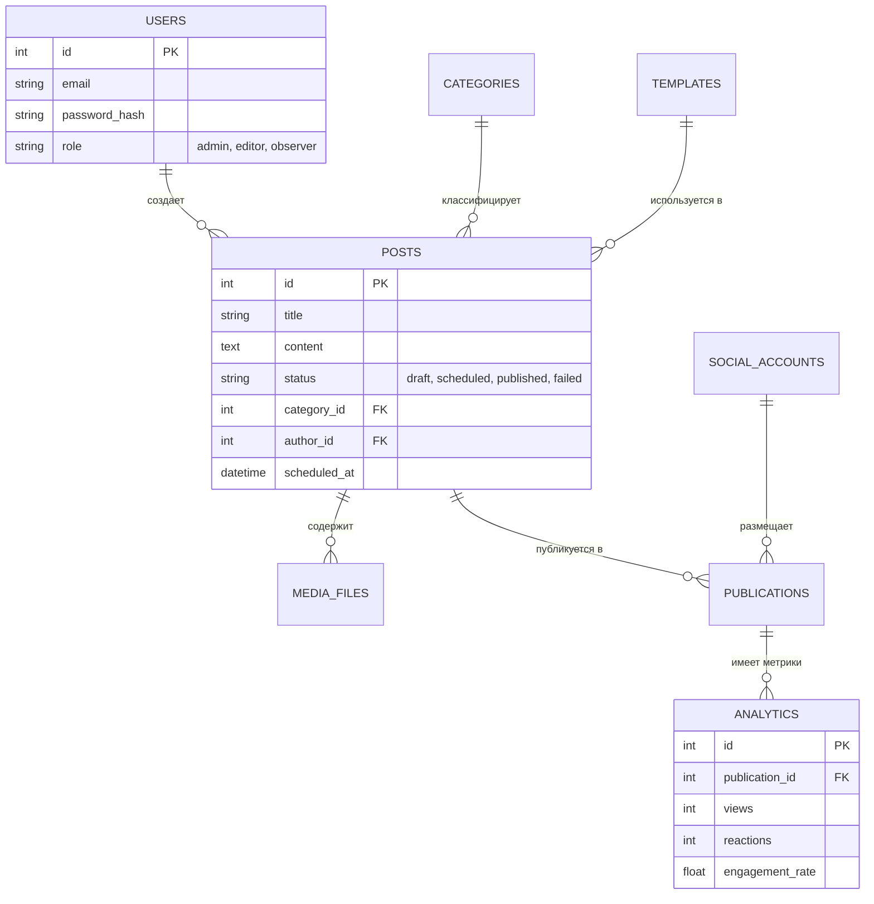

# Структура базы данных "Медиахаб" (SQLite 3)

## 1. Визуальная схема связей

## 2. Описание таблиц

### Таблица `users` (Пользователи)
Хранит данные сотрудников и их права доступа.
- `id`: Уникальный идентификатор.
- `email`: Логин (уникальный).
- `password_hash`: Хеш пароля.
- `role`: Роль (`admin` — полный доступ, `editor` — работа с контентом, `observer` — только просмотр).

### Таблица `categories` (Категории)
Тематические разделы для постов.
- `name`: Название (например, "Гранты").
- `slug`: URL-имя.
- `color`: HEX-код цвета для календаря.

### Таблица `templates` (Шаблоны)
Заготовки текстов для быстрой публикации.
- `content_template`: Текст с плейсхолдерами типа `{title}`, `{date}`.
- `variables`: Список доступных переменных в формате JSON.

### Таблица `posts` (Посты)
Основная сущность контент-плана.
- `status`: Состояние (`draft` — черновик, `scheduled` — запланирован, `published` — опубликован).
- `scheduled_at`: Время автоматической публикации.
- `category_id`, `template_id`, `author_id`: Внешние ключи.

### Таблица `media_files` (Медиа)
Изображения и видео, прикрепленные к постам.
- `file_url`: Путь к файлу или ссылка.
- `file_type`: Тип контента (image, video).

### Таблица `social_accounts` (Аккаунты соцсетей)
Данные для интеграции с внешними площадками.
- `platform`: Тип площадки (`vk`, `telegram`).
- `access_token`: Токен доступа для API.

### Таблица `publications` (Публикации)
Связующее звено между постом и конкретной соцсетью.
- `external_post_id`: ID поста в самой соцсети (нужен для сбора статистики).
- `status`: Статус отправки.

### Таблица `analytics` (Аналитика)
Метрики эффективности каждой публикации.
- `views`, `reactions`, `comments`, `shares`: Количественные показатели.
- `engagement_rate`: Коэффициент вовлеченности (ER).

---
*Файл сгенерирован автоматически на основе текущей реализации моделей SQLAlchemy.*
